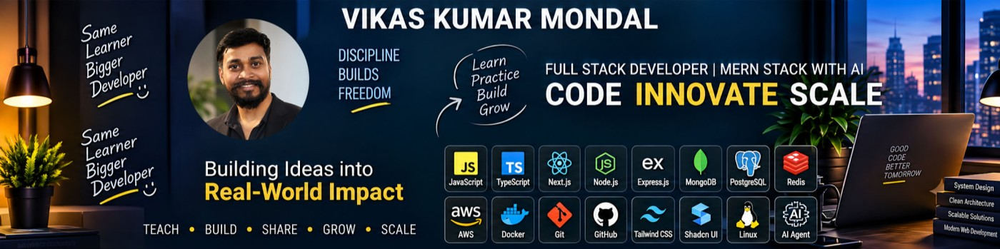

  

# Hi, I'm Vikas Kumar 👋

### Full Stack MERN Developer | React.js | Next.js | Node.js | AI Applications

I am a Full Stack Developer with 3+ years of experience building scalable web applications, enterprise software, AI-powered platforms, and modern SaaS products.

Currently focused on:
- React.js & Next.js Applications
- Node.js Backend Development
- AI Agents & LLM Integrations
- System Design & Scalable Architectures
- Cloud & DevOps

---

## 🚀 Tech Stack

### Frontend

### Backend

### AI & Agents
- LangGraph
- LangChain
- Groq
- Google Gemini
- DeepSeek
- Tavily Search
- Qdrant Vector DB

### DevOps & Cloud
- Docker
- GitHub Actions
- AWS S3
- Nginx
- PM2
- Linux (Ubuntu)

---

# 🏆 Featured Enterprise Projects

## 🤖 Bearly AI (AI SaaS Platform)

AI-powered SaaS platform built using LangGraph, LangChain, Groq, Gemini, Qdrant, Redis and MongoDB.

### Highlights
- Multi-LLM Support
- AI Agents
- Vector Search (RAG)
- PDF Generation
- PPT Generation
- AI Chat
- Payment Integration
- AWS S3 Storage

**Tech:** React 19, Node.js, LangGraph, Groq, Gemini, Qdrant, Redis

---

## 🧠 Quietamind

AI-Powered Mental Wellness & Dream Analysis Platform.

### Features
- Dream Journal
- AI Dream Analysis
- Meditation Center
- AI Therapist
- Mood Tracking
- Sleep Analytics
- AI Generated Dream Art
- Multi-language Support

**Tech:** Next.js, React 19, Gemini AI, Redux Toolkit, Tailwind CSS

---

## 🛕 ISKCON Management System

Temple Management & Donation Platform.

### Features
- Donation Management
- Seva Booking
- Online Payments
- Receipt Generation
- CMS Management
- Role-Based Access Control
- Reports & Analytics

**Tech:** Next.js, Node.js, MongoDB, Razorpay

---

## 🏠 Nestfin

Property Rental & Tenant Management Platform.

### Features
- Tenant Management
- Property Management
- Rental Tracking
- Dashboard Analytics
- Admin Management

**Tech:** MERN Stack

---

## 🏢 Enterprise Projects

### AIM Software (Tech Mahindra - Comviva)

Lead Management & Customer Workflow Platform developed for enterprise operations.

### HRMS

Human Resource Management System with employee lifecycle management, attendance, payroll workflow and reporting modules.

---

## 🎯 Currently Building

- AI Agents using LangGraph & LangChain
- Scalable MERN Applications
- Next.js Enterprise Dashboards
- Docker & CI/CD Pipelines
- Vector Search with Qdrant